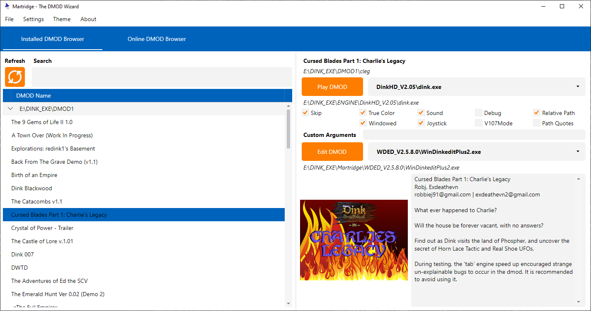
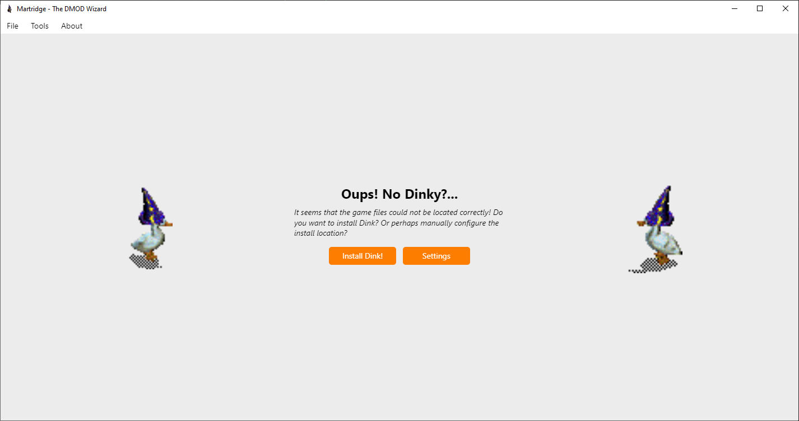
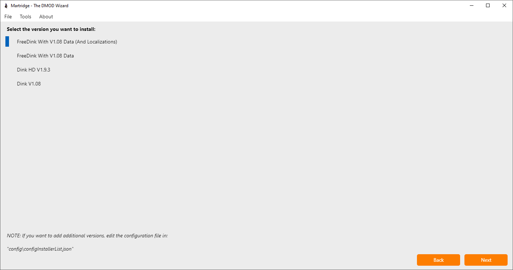
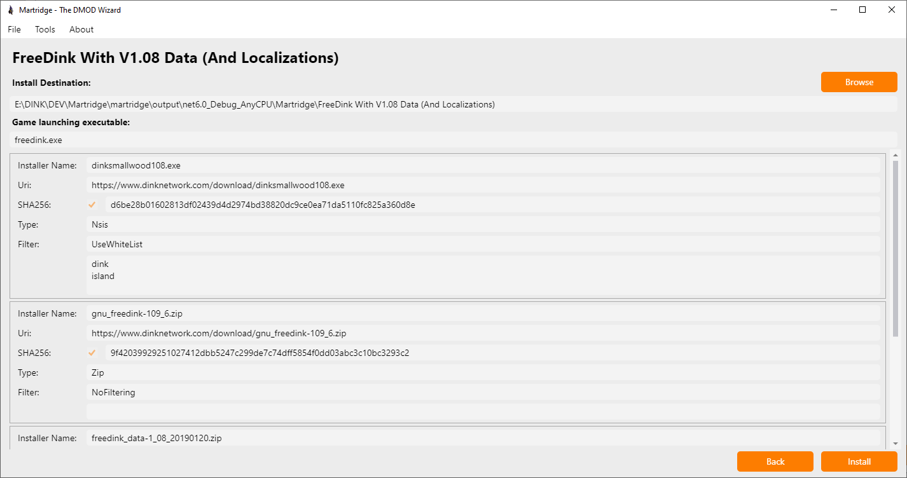
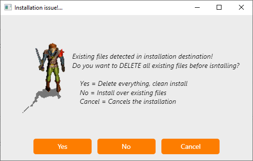
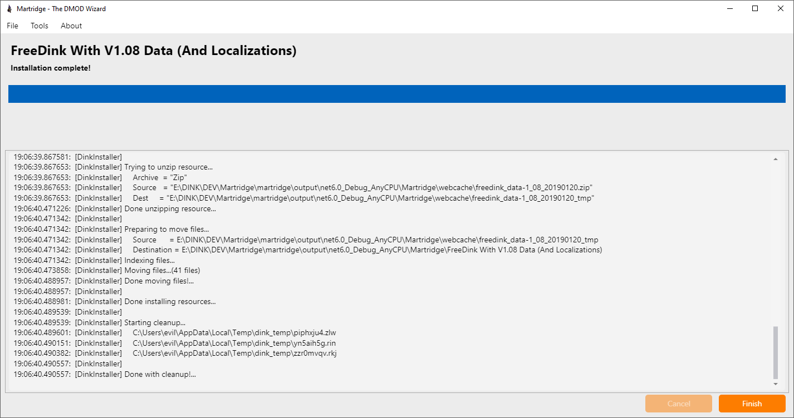
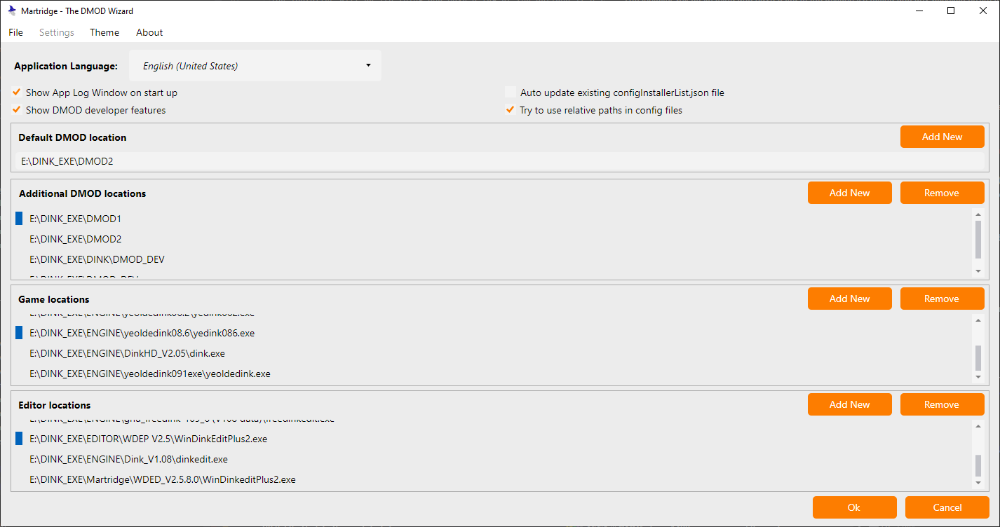
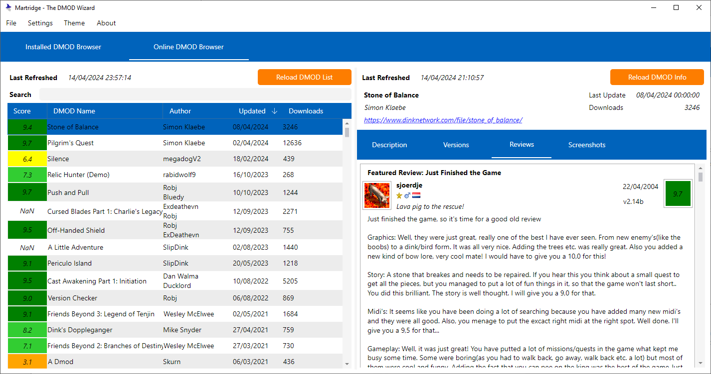
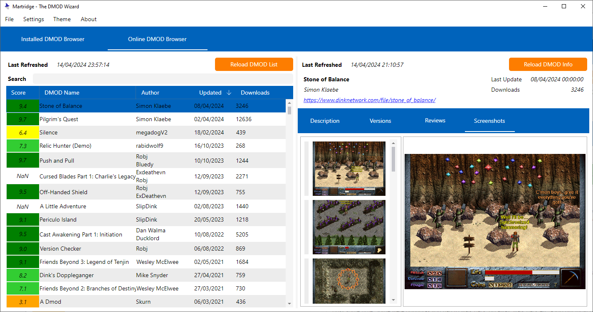

# Martridge - The DMOD Wizard
## What is this?
Ever heard of Dink Smallwood? Well, now you have! If you have no idea what I'm talking about, just head over to [The Dink Network](https://www.dinknetwork.com/forum.cgi) for more info about Dink!

Anyway, this Dink game has a ton of community content in the form of custom stories called DMODs. 

This application is a DMOD manager/launcher for Dink Smallwood.



## What can it do?
- Runs on Windows and Linux using .NET [1]
- Automagically install a number of versions of the Dink engine and editors on Windows [2]
- Select from multiple user configurable Dink engine or editor versions to launch a DMOD with [3]
- Lets you manage DMODs already installed in multiple user configurable locations
- Is localizable using .json files [4] 
- Supports DMOD localization, only when using FreeDink
- Features an online DMOD browser that parses HTML data from the Dink Network, so you can browse and install dmods with just a click or two

### Notes
1. The application uses [AvaloniaUI](https://avaloniaui.net/) for its GUI Framework

2. The config file defining installable Dink engines and editors is now pulled from here: [https://github.com/drone1400/martridge-cfg-install](https://github.com/drone1400/martridge-cfg-install)

3. The following versions can be installed under windows:
- FreeDink - considered the best way to play Dink by the community
- DinkHD - the current official release of Dink, available on multiple platforms like Android or MacOS but unfortunately not on Linux systems
- The original Dink Smallwood V1.08 - the decade old original release, still runs under Windows, although you probably don't wnat to use this anymore...

4. Application Localization is WIP - Technically works but only english is available right now, I need to add more info about how to define the localization files using a template later...

## Building
Assuming that you're somewhat familiar with dotnet applications...
1. Clone this git
2. Restore submodules
```git submodule update --init --recursive```
3. Publish the project to folder using dotnet

NOTE: you can run the included `build-everything.ps1` file to publish to folder the following configurations: `win-x86`, `win-x64`, `linux-x64`, `osx-x64`, `osx-arm64`.
Alternatively, you can just manually pick one of the included publish configurations to use.
The `build-everything-readytorun.ps1` script does the same thing but publishes using the "ready to run" feature, which makes the application start up slightly faster at the expense of a bigger file size.

Here is an example publish command for win-x64: ```dotnet publish ./martridge/src/martridge.csproj --output ./publish/net8.0_win-x64/martridge/ --configuration Release -p:Platform="x64" --framework net8.0 --runtime win-x64 --self-contained true -p:PublishSingleFile=true -p:IncludeNativeLibrariesForSelfExtract=true```

## Overview

### First time?
When the application launches for the first time, it should look something like this:


If you are on Windows, you can click Install Dink to be taken to the auto-magical Dink installer interface. (Also accessible via File-> Install Dink!) It should be pretty straight forward...

Note that under linux the installer will tell you to manually install FreeDink instead. Normally, the application should detect the default FreeDink installation if you already have it installed under certain distributions like Ubuntu for example.

### Dink Installer (Windows)
The dink installer will first ask you to select which version you want to install:


Afterwards, you will see a detailed description of the files involved in the installation, and of course choose your install destination:


Important note: The automated-installer can be scripted to some extent using the file located in the subfolder "config/configInstallerList.json", but more on this later...


If you try to install over existing files you will be given this warning:

WARNING: Choosing YES will delete everything in the destination directory!

The installer will do its thing and have a log of the actions it's taking and any possible errors that might pop up (hopefully not, hah)


### Settings
The settings interface looks like this:


These can also be manually edited in "config/config.json"

- Show App Log Window on startup: enabled by default, does exactly as it says, the log window should display any errors or warnings that occur, this is mostly for debugging purposes
- Show DMOD developer features: enabled by default, shows DMOD dev features such as the launch editor button and pack DMOD commands, disable this if you don't care about them
- Try to use relative paths in config files: this will store all subfolders in the config.json file as relative to the application root, helps if you want the application to be portable to another computer
- Application Language: self explanatory, however only english is available right now (WIP)
- Auto update existing configInstallerList.json: leftover from previous version, currently doesn't do anything
- Default DMOD location: this is the main location where the application should install dmods (although it lets you choose others during DMOD installation too...)
- Additional DMOD locations: the application can look in these directories for installed dmods
- Game locations: Dink engine executables used to launch the game, you can even have different versions of the same engine if you so desire
- Editor locations: Dink editor executables used to edit DMODs

### DMOD Browser
The DMOD browser looks like this:

On the left you have a list of DMODS that were found. On the right you have the currently selected DMOD info. In the top left above the list, you can hit the refresh button to scan the directories for DMODS again or use the Search input box to filter the DMODS if you have too many.

DMODs get grouped by their root install directories.

You can click the "DMOD Name" header to toggle sorting DMODs by name in ascending or descending orders.

In the DMOD info, you can select which Game Engine to use to launch the game (if you have more than one configured in Settings).
You have the usual launch options as in DFArc, and below the launch button you have the FreeDink localization selection. Obviously, this only works if the selected DMOD has localization files in the first place, and you are using FreeDink.

### Online DMOD Browser
The online DMOD browser shows you all kinds of DMOD related info straight from [The Dink Network](https://www.dinknetwork.com/files/category_dmod/sort_title-asc/page_1/)
NOTE: Currently data is not automatically refreshed, and it is only downloaded if missing or you hit the Refresh button. To refresh existing DMOD data you have to right click in the DMOD info area on the right and select "Reload DMOD Online Data".
Online data gets cached in the local subfolder "webcache".

You can view DMOD reviews, screenshots and all the released versions straight from the application. NOTE that this is NOT a browser renderer, but rather parses the HTML data and renders it using native AvaloniaUI controls.




## TODO...
There are still some things I'd like to do before a proper V1.0 release:
- Write a proper documentation static website for it using Material for MkDocs
- Improve the Dink Installer feature so you can choose where to source the `configInstallerList.json` file from (currently it is hardcoded to get the latest version from https://github.com/drone1400/martridge-cfg-install)
- Add proper SteamDeck support (currently certain controls like combo-boxes and message boxes don't render with the deck in game mode plus some other issues...)
- Maybe add NSIS installer format support to SharpCompress so I don't have to rely on the extra 7zip wrapper anymore (this would also help make the Dink installer work on Linux for FreeDink)
- Maybe change DMOD launch options so they can be saved separately on a per engine/editor basis