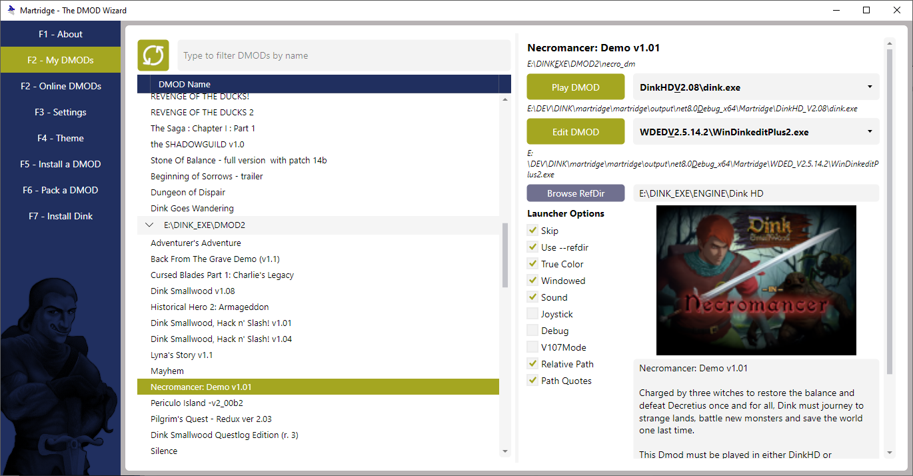
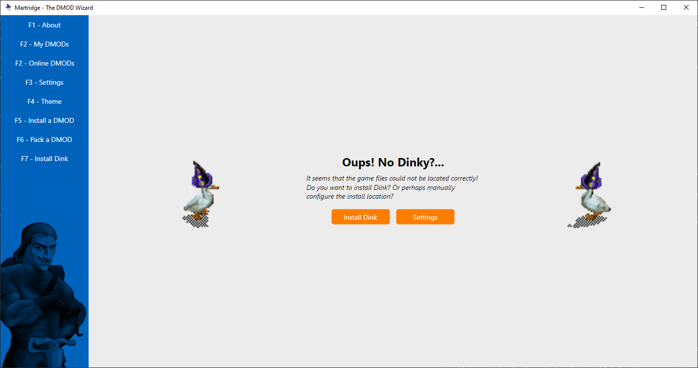
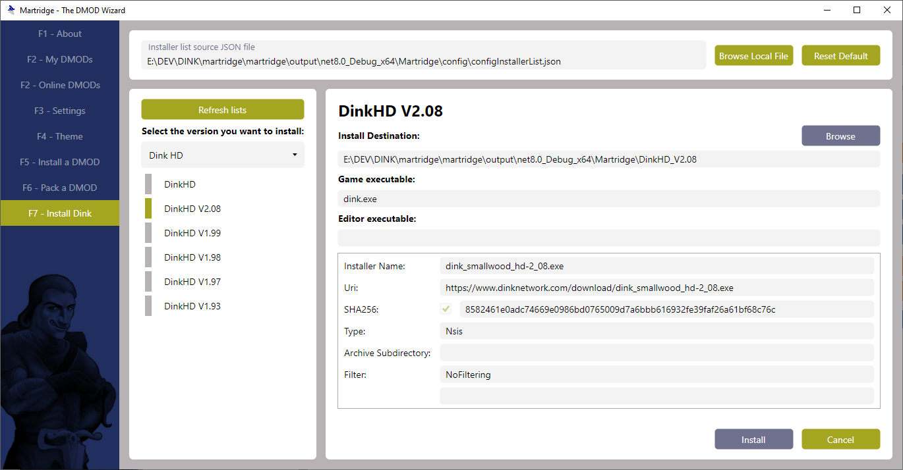
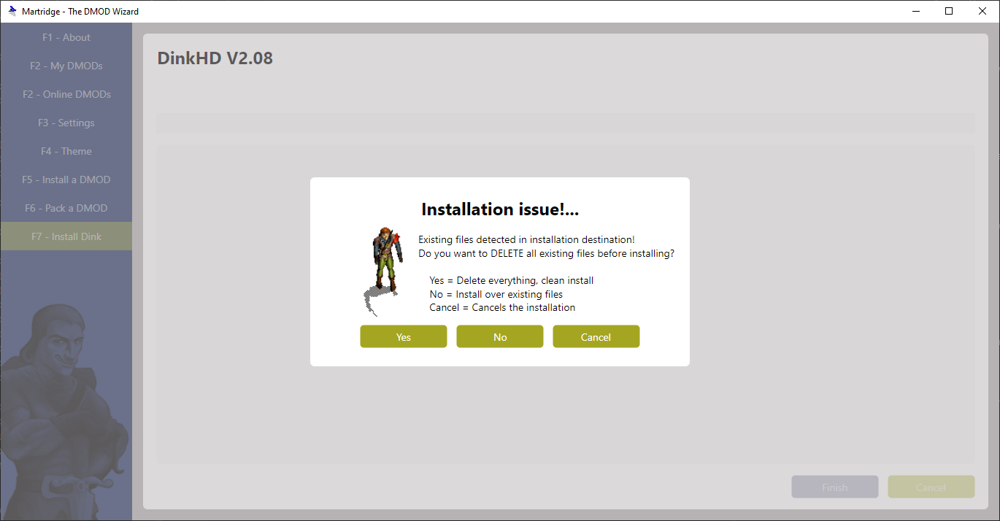
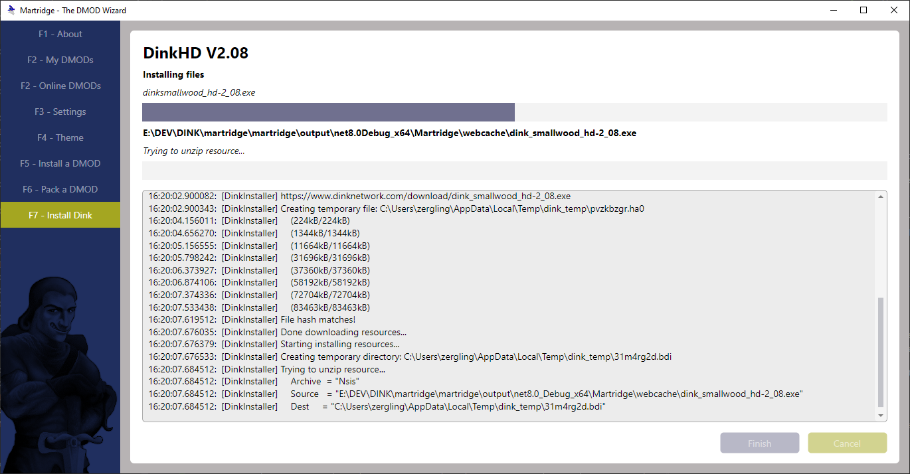
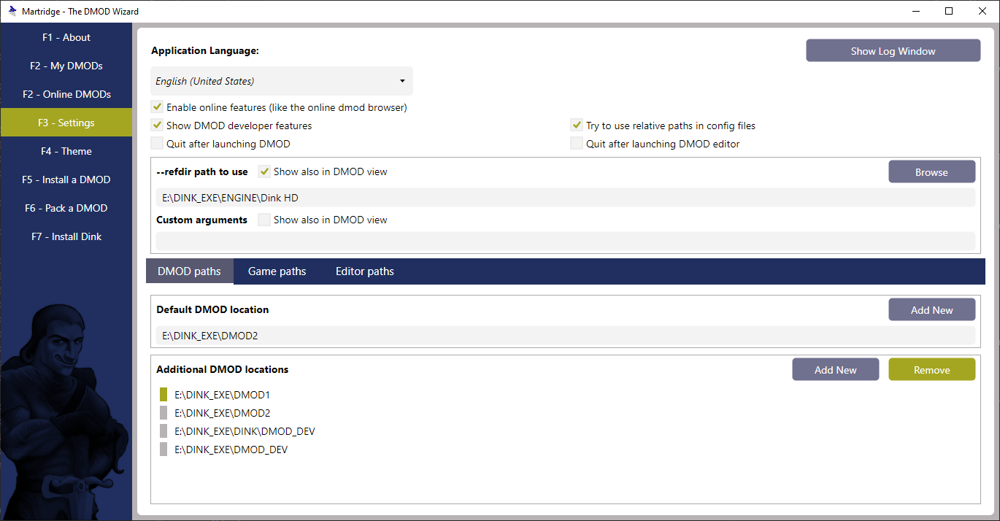
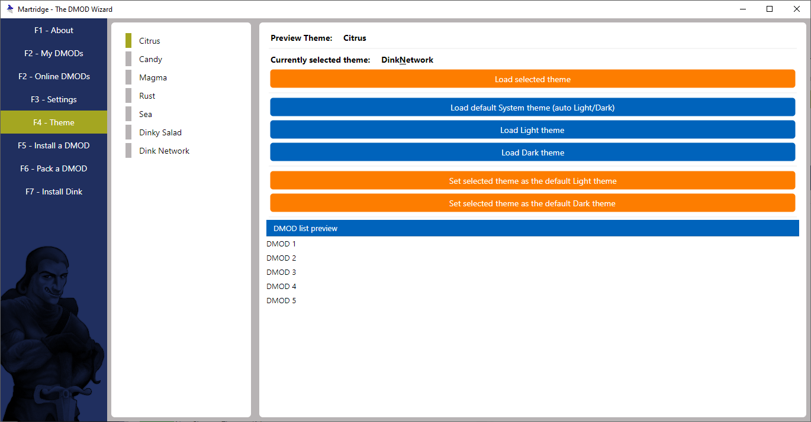
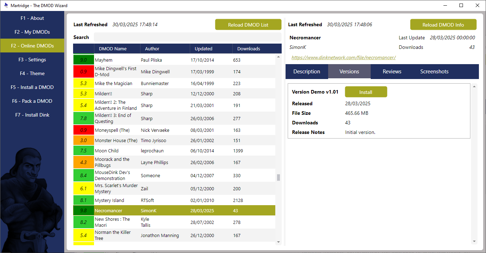

# Martridge - The DMOD Wizard
## What is this?
Ever heard of Dink Smallwood? Now you have! If you have no idea what I'm talking about, just head over to [The Dink Network](https://www.dinknetwork.com/forum.cgi) for more info about Dink!

Anyway, this Dink game has a ton of community content in the form of custom stories called DMODs. 

This application is a DMOD manager/launcher for Dink Smallwood.



## What can it do?
- Runs on Windows, Linux and MacOS using .NET
- Select from multiple user configurable Dink engine or editor versions to launch or edit a DMOD
- Lets you manage DMODs already installed in multiple user configurable locations
- Has an online DMOD browser that parses HTML data from the Dink Network, so you can browse and install dmods with just a click or two
- Supports DMOD localization, only when using FreeDink or YeOldeDink
- Automagically install a number of versions of the Dink engine and editors on Windows
- You can customize theme colors
- Is localizable using .json files

## Overview

### First time?
When the application launches for the first time, it should look something like this:


If you are on Windows, you can click Install Dink to be taken to the auto-magical Dink installer interface. (Also accessible via File-> Install Dink!) It should be pretty straight forward...

Note that under linux the installer will tell you to manually install FreeDink instead. Normally, the application should detect the default FreeDink installation if you already have it installed under certain distributions like Ubuntu for example...

### Hotkeys
Martridge now has a few hotkeys for quickly jumping between the main pages. These are currently hardcoded to the following:
- `F1` - An about / help page
- `F2` - Toggle between installed DMOD browser and Online DMOD browser (The Online DMOD browser is only available if Online Features are enabled)
- `F3` - The Settings page
- `F4` - The Theme selection page
- `F5` - The DMOD installer page
- `F6` - The DMOD packer page (only if DMOD developer options are enabled)
- `F7` - The Dink Installer page (only on Windows if Online Features are enabled)

- `ESC` - Exits certain pages returning to the installed DMOD browser
- `CTRL+L` - Shows/focuses Log Window

Only on the **DMOD Browser** page:
- `CTRL+D` - Launches selected DMOD with currently selected game engine
- `CTRL+E` - Edits selected DMOD using selected DMOD editor

### Dink Installer (Windows only)
On Windows only, the Dink Installer page lets you auto-magically install one of the known Dink distributions. 



After selecting what version to install, if you are trying to install over existing files you should get a warning message:

WARNING: Choosing YES will delete everything in the destination directory!

The installer will do its thing and have a log of the actions it's taking and any possible errors that might pop up (hopefully not, hah)


**NOTE:** The installer component uses a configurable json file to define where to download the installable files from and how to extract them. By default, the configuration file that is used is located here: [https://github.com/drone1400/martridge-cfg-install/blob/master/configInstallerList.json](https://github.com/drone1400/martridge-cfg-install/blob/master/configInstallerList.json)

If you prefer, you can use your own custom URL or a local config file instead.

**NOTE:** Currently I do not have any in-depth documentation regarding the installer script format, if there is any interest for this, I can add some proper documentation at a later date.

### Settings
The Settings page looks like this:


You can configure a number of things here:
- The **Enable online features** checkbox controls if the Online DMOD browser and Dink Installer components are enabled or not
- The **Try to use relative paths in config files** checkbox will make it so Martridge tries to save the known DMOD and engine paths as relative, this may help if you want to keep a portable installation of Martridge
- The **Show DMOD developer features** checkbox enables UI elements that are relevant for DMOD developers, like the Edit DMOD button, or Pack a DMOD page
- The **Quit after launching DMOD** and **Quit after launching DMOD editor** checkboxes make it so Martridge exits as soon as you launch/edit a DMOD
- The **--refdir path to use** option lets you configure the **--refdir** parameter when launching/editing DMODs, this is used to override the core Dink installation location and is relevant in certain engines like YeOldeDink and my own WDED Dink editors
- The **Custom arguments** option lets you manually define other custom arguments
- The **Show also in DMOD view** checkboxes control if the previous options are also displayed in the DMOD browser page or only the Settings page

Below, you can configure the DMOD folder paths, also the Game and Editor executables

NOTE: Some additional settings can be tweaked manually in the `config/config.json` file

### Theme
The Theme page lets you select and preview a different theme color set for Martridge


- The **Load selected Theme** button loads the selected theme immediately.
- The **Load default system theme** button makes Martridge use a default Light or Dark theme based on system settings
- The **Load Light theme** or **Load Dark theme** loads the currently default Light or Dark themes
- The Set Selected theme as the default Light/Dark theme** buttons let you override the default Light and Dark themes that are used by Martridge; this is useful if you are using the auto system theme detection

### Custom Themes
You can also define your own custom themes, and it's not too complicated! A couple of themes are provided as examples. Simply create a custom theme `.axaml` file in the `custom-themes` subfolder based on a copy of the existing example themes (`Dink_Network.axaml` and `Dinky_Salad.axaml`) and replace the `Color="#70708F"` properties with your custom color hex code.

You can even replace the image of Dink in the left sidepanel with a custom image by editing these two properties:
```xml
<x:String x:Key="MartridgeSidePanelImageBlendMode">SourceAtop</x:String>
<x:String x:Key="MartridgeSidePanelImageSource">DinkColor1.png</x:String>
```
The `MartridgeSidePanelImageSource` property value needs to be a file location relative to the `custom-themes` folder. 

The `MartridgeSidePanelImageBlendMode` property value needs to be a valid AvaloniaUI Bitmap blend mode, you can see the full list of options here: [https://docs.avaloniaui.net/docs/concepts/blend-modes](https://docs.avaloniaui.net/docs/concepts/blend-modes)

### DMOD Browser
The DMOD browser looks like this:

On the left you have a list of DMODS that were found. On the right you have the currently selected DMOD info. In the top left above the list, you can hit the refresh button to scan the directories for DMODS again or use the Search input box to filter the DMODS if you have too many.

**Important Note** - If the window size is too small, the DMOD list and selected DMOD will not be both visible at the same time.

DMODs get grouped by their root install directories.

You can click the "DMOD Name" header to toggle sorting DMODs by name in ascending or descending orders.

After selecting a DMOD, you can choose what game engine to play the DMOD with, or if you have DMOD developer options enabled, you can choose what editor to edit the DMOD with.

Below you have various launch options similar to the old DFArc, and a few additional ones.

### Online DMOD Browser
The online DMOD browser shows you all kinds of DMOD related info straight from [The Dink Network](https://www.dinknetwork.com/files/category_dmod/sort_title-asc/page_1/)

Online data gets cached in the local subfolder "webcache".

You can view DMOD reviews, screenshots and all the released versions straight from the application. NOTE that this is NOT a browser webview, but rather parses the HTML data and renders it using native AvaloniaUI controls!


## Building
Assuming that you're somewhat familiar with dotnet applications...
1. Clone this git
2. Restore submodules
   ```git submodule update --init --recursive```
3. Publish the project to folder using `dotnet`

You can use one of the included powershell scripts for publishing the application:
- `publish-linux-x64.ps1`
- `publish-osx-arm64.ps1`
- `publish-osx-x64.ps1`
- `publish-win-x64.ps1`
- `publish-win-x86.ps1`

You can also make a build that does not have any online features or does not have the Dink Installer components using these powershell scripts:
- `publish-linux-x64-offline.ps1`
- `publish-osx-arm64-offline.ps1`
- `publish-osx-x64-offline.ps1`
- `publish-win-x64-noinstaller.ps1`
- `publish-win-x64-offline.ps1`